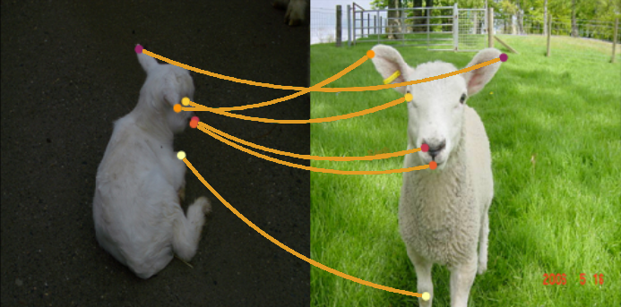
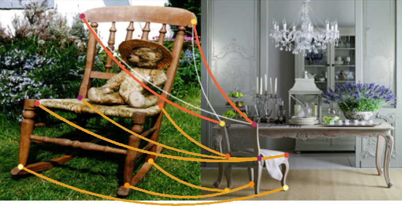

# Deep Graph Matching via Blackbox Differentiation of Combinatorial Solvers 

This repository contains PyTorch implementation of the paper: [Deep Graph Matching via Blackbox Differentiation of Combinatorial Solvers .](https://arxiv.org/abs/2003.11657) 

It also contains the configuration files to reproduce the numbers reported in the paper for the following experiments:
 * **PascalVOC** Using keypoint-intersection filtering and unfiltered keypoints. Also with multi-matching solver in postprocessing.
 * **Willow** Pre-training on PascalVOC and fine tuning on Willow can be controlled separately
 * **SPair-71k** With the default *intersection* keypoint filetering.
 
See also the [LPMP repository](https://github.com/LPMP/LPMP) with the combinatorial solvers for graph matching and multi-graph matching as well corresponding PyTorch modules. The solvers were made differentiable via [blackbox-backprop](https://github.com/martius-lab/blackbox-backprop) ([Differentiation of Blackbox Combinatorial Solvers](https://openreview.net/forum?id=BkevoJSYPB))  

Sheep |  Chair  |  Airplane    
:-------------------------:|:-------------------------:|:-------------------------:
   |    | 


## Get started
1. Check if gcc-9, g++-9, cmake are available (for building `lpmp_py`).
1. Check if findutils (>=4.7.0) is available
1. Check if hdf5 is installed (``apt install libhdf5-serial-dev``)
1. Check if cuda 10.1 and cudnn 7 are available
1. Check if texlive-latex-extra is installed (``apt install texlive-latex-extra``)
1. Run ``pipenv install`` (at your own risk with `--skip-lock` to save some time).
1. Run ``chmod +x ./download_data.sh && ./download_data.sh``.
1. Try running a training example, if the import of torch_geometric fails, follow [this.](https://pytorch-geometric.readthedocs.io/en/latest/notes/installation.html)

## Training

Run training and evaluation

```
python3 -m pipenv shell
python3 train_eval.py path/to/your/json
``` 

where ``path/to/your/json`` is the path to your configuration file. Configurations that reproduce the scores reported in the paper are in ``./experiments``.

### Willow 
In order to run Willow with an architecture pretrained on PascalVOC, you need to create a snapshot to warm-start with. For this purpose, run ``python3 train_eval.py experiments/willow/voc_pretrain.json``. Then enter the path to the checkpoint into `pretrain_[no]finetune.json` in the field `warmstart_path`. 

## Troubleshooting
* **NANs or significantly worse scores** Check your installation of torch_geometric, torch_sparse, torche_scatter, torch_cluster and torch_spline_conv. Go to the repositories and check the latest installation instructions and make sure to compile locally.

## Citation

```text
@article{rolinek2020deep,
    title={Deep Graph Matching via Blackbox Differentiation of Combinatorial Solvers},
    author={Michal Rolínek and Paul Swoboda and Dominik Zietlow and Anselm Paulus and Vít Musil and Georg Martius},
    year={2020},
    eprint={2003.11657},
    archivePrefix={arXiv},
    primaryClass={cs.LG}
}
```
